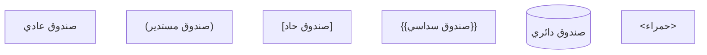
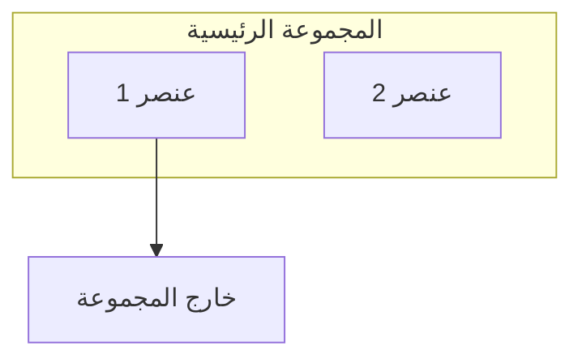
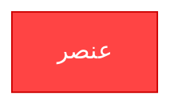
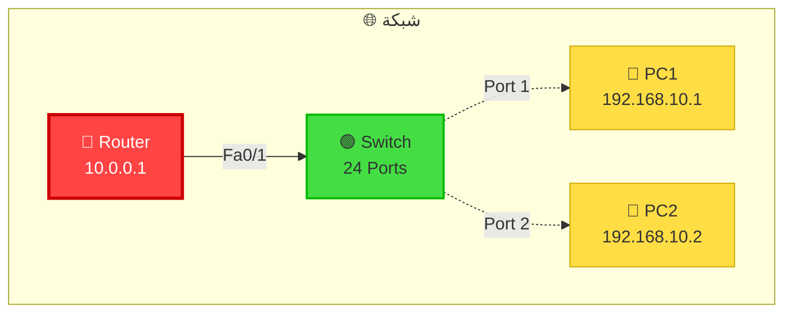
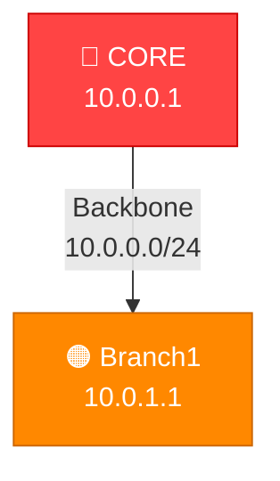

# 📖 شرح الكود بالتفصيل الدقيق

## 🔍 فهم كود Mermaid للرسومات

---

## 1️⃣ البنية الأساسية للكود

```mermaid
graph TB                    # TB = Top to Bottom (من الأعلى للأسفل)
    A["Node A"]            # عُقدة أولى
    B["Node B"]            # عُقدة ثانية
    A --> B                # سهم من A إلى B
```

### شرح:
- `graph TB` = نوع الرسم (من الأعلى للأسفل)
- `["Text"]` = نص داخل الصندوق
- `-->` = سهم متجه

---

## 2️⃣ أنواع الرسومات (Diagram Types)

```
graph TB     = Top to Bottom (من الأعلى للأسفل)
graph LR     = Left to Right (من اليسار لليمين)
graph BT     = Bottom to Top (من الأسفل للأعلى)
graph RL     = Right to Left (من اليمين لليسار)
```

---

## 3️⃣ أنواع الصناديق (Node Shapes)



### الاستخدام في المشروع:
```
["Router0-Core"]     = صندوق عادي للروترات
["VLAN 10"]          = صندوق عادي للـ VLANs
["192.168.10.1"]     = صندوق عادي للـ IPs
```

---

## 4️⃣ أنواع الأسهم والخطوط (Edges/Links)

```
-->          = سهم بسيط
-.->         = سهم متقطع
==>          = سهم ثقيل
-.-          = خط متقطع
--           = خط بسيط
|Text|       = نص على السهم
```

### الاستخدام في المشروع:
```
Router0 -->|Fa0/0| Router1     = سهم مع نص الـ Interface
Switch -.->|VLAN 10| PC        = سهم متقطع للـ Access
```

---

## 5️⃣ المجموعات الفرعية (Subgraphs)



### الاستخدام في المشروع:
```mermaid
subgraph Backbone["🌐 Backbone Network"]
    Router0
    Router1
    Router0 --> Router1
end
```

---

## 6️⃣ التنسيق والألوان (Styling)



### المكونات:
- `fill:#FF4444` = لون الخلفية
- `stroke:#CC0000` = لون الحدود
- `color:#fff` = لون النص
- `stroke-width:3px` = سمك الحدود

---

## 7️⃣ مثال عملي شامل (Complete Example)



### الشرح:
1. `subgraph` = مجموعة تحتوي على العناصر
2. `["🔴 Router"]` = صندوق مع رموز
3. `<br/>` = سطر جديد في الصندوق
4. `-->|Fa0/1|` = سهم مع نص
5. `classDef` = تعريف الأسلوب
6. `class` = تطبيق الأسلوب

---

## 8️⃣ شرح رسم الشبكة الفعلي

### الجزء الأول: الـ Backbone

```mermaid
subgraph Backbone["🌐 Backbone Network"]
    R0["🔴 CORE ROUTER<br/>10.0.0.1"]
    R1["🟠 Router1<br/>10.0.1.1"]
    R2["🟠 Router2<br/>10.0.2.1"]
    
    R0 -->|Fa0/0| R1
    R0 -->|Fa0/1| R2
end
```

**الشرح:**
- `subgraph` = تجميع الروترات في مجموعة واحدة
- `R0` = اختصار المتغير (لتقليل الكود)
- `-->` = اتصال مباشر
- `|Fa0/0|` = اسم الـ Interface

---

### الجزء الثاني: الـ VLAN والأجهزة

```mermaid
subgraph Branch["🏢 BRANCH Network"]
    Switch["🟢 SWITCH 1"]
    
    HR["VLAN 10<br/>192.168.10.0/24"]
    
    PC1["💼 PC1<br/>192.168.10.1"]
    PC2["💼 PC2<br/>192.168.10.2"]
    
    Switch --> HR
    HR --> PC1
    HR --> PC2
end
```

**الشرح:**
- الـ Switch تحتوي على الـ VLANs
- الـ VLAN تحتوي على الأجهزة
- السهم = اتصال منطقي

---

### الجزء الثالث: الروابط

```mermaid
Router1 -->|Trunk 802.1Q| Switch1
Switch1 -.->|Access VLAN10| PC1
```

**الشرح:**
- `Router1 -->` = اتصال مباشر
- `Switch1 -.->` = اتصال متقطع (access)
- `|Trunk 802.1Q|` = نص على السهم

---

## 9️⃣ الألوان المستخدمة

```
Red:       #FF4444    (Core)
Orange:    #FF8800    (Branch)
Green:     #44DD44    (Switch)
Blue:      #4488FF    (VLAN)
Yellow:    #FFDD44    (PC)
Purple:    #FF44FF    (Server)
Cyan:      #33CCFF    (Backbone)
```

### تعريف الألوان:
```mermaid
classDef core fill:#FF4444,stroke:#CC0000,stroke-width:3px,color:#fff
classDef branch fill:#FF8800,stroke:#CC6600,stroke-width:3px,color:#fff
```

---

## 🔟 نصائح الكود المهمة

### ✅ استخدم الاختصارات:
```
❌ Core_Router_Main
✅ R0

❌ VirtualLAN_Humans_Resources
✅ HR
```

### ✅ استخدم الرموز:
```
❌ Router
✅ 🔴 Router

❌ Switch
✅ 🟢 Switch
```

### ✅ استخدم Line Breaks:
```
❌ Router0 10.0.0.1 Central Hub
✅ Router0<br/>10.0.0.1<br/>Central Hub
```

### ✅ استخدم التعليقات:
```
// هذا تعليق (لن يظهر)
-- هذا تعليق أيضاً
```

---

## 1️⃣1️⃣ مثال متقدم: الجمع كله



**الشرح:**
- `%% comment` = تعليق
- الاختصارات تسهل الكود
- كل شيء يبقى منظم

---

## 1️⃣2️⃣ المشاكل الشائعة والحل

### المشكلة: الرسم لا يظهر

**السبب:**
```
graph TB                    ❌ مسافة ناقصة
    A[Node]
```

**الحل:**
```
graph TB
    A["Node"]               ✅ علامات صحيحة
```

---

### المشكلة: نص غريب الشكل

**السبب:**
```
A[Router0 10.0.0.1]        ❌ بدون line break
```

**الحل:**
```
A["Router0<br/>10.0.0.1"]  ✅ مع line break
```

---

### المشكلة: الألوان لا تعمل

**السبب:**
```
classDef core fill:FF4444  ❌ بدون #
class A core               ❌ كبيرة وصغيرة مختلفة
```

**الحل:**
```
classDef core fill:#FF4444,stroke:#CC0000
class R0 core              ✅ R0 تماماً كما عرفت
```

---

## 1️⃣3️⃣ الخلاصة السريعة

### البنية الأساسية:
```mermaid
graph [direction]
    [nodes]
    [connections]
    [styling]
```

### الاتجاهات:
- TB = Top to Bottom (⬇️)
- LR = Left to Right (➡️)

### الأسهم:
- `-->` = مباشر
- `-.->` = متقطع

### التنسيق:
```
["Text"]
["Text<br/>Line2"]
"Extra details"
```

### الألوان:
```
classDef name fill:#color,stroke:#color,color:#text
class nodeID name
```

---

## 🎯 الخطوات السريعة

1. ابدأ بـ: `graph TB`
2. عرّف العُقد: `A["Name"]`
3. أضف الاتصالات: `A --> B`
4. عرّف الأسلوب: `classDef style fill:#color`
5. طبّق الأسلوب: `class A style`

---

## 📞 موارد إضافية

```
Mermaid Docs:
https://mermaid.js.org/

Mermaid Live:
https://mermaid.live/

Syntax Reference:
https://mermaid.js.org/syntax/graph.html
```

---

**الآن تفهم الكود تماماً!** ✨

يمكنك تعديل أي رسم حسب احتياجك بثقة. 🚀
