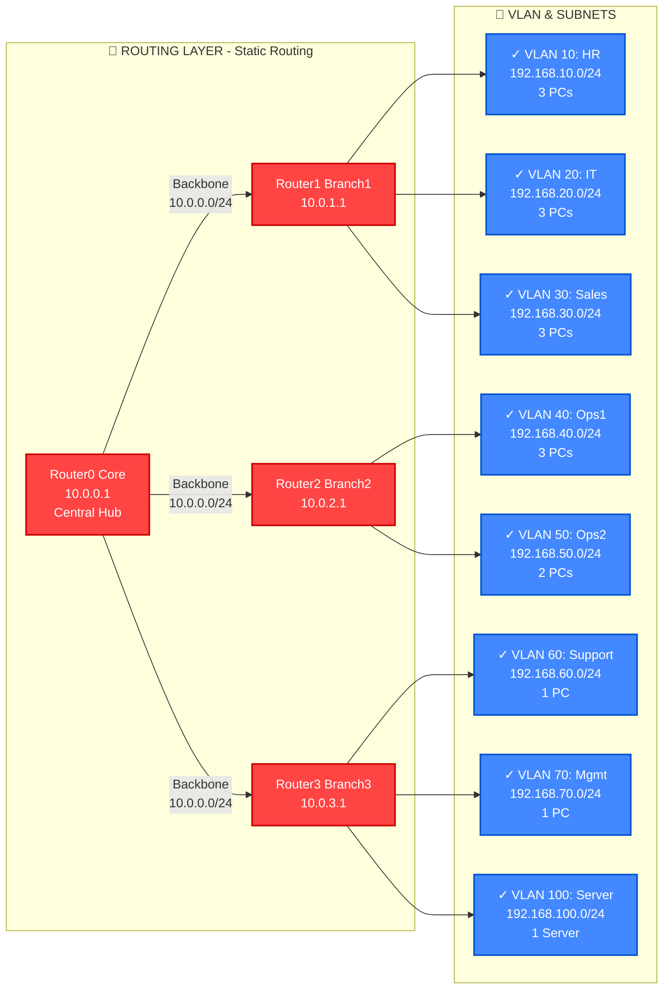
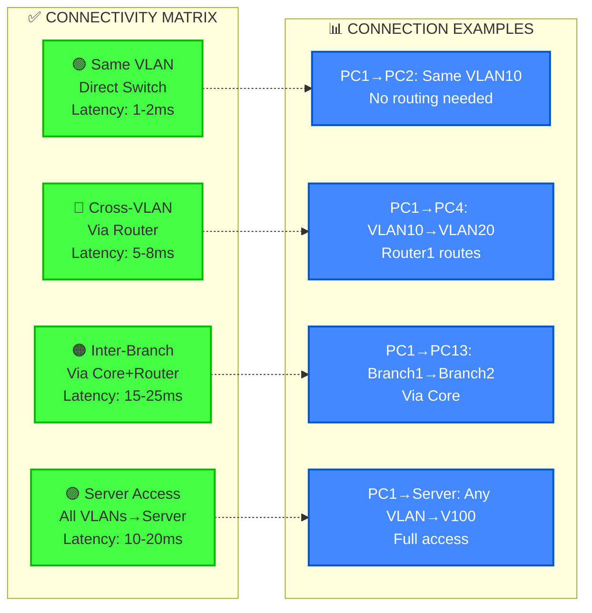
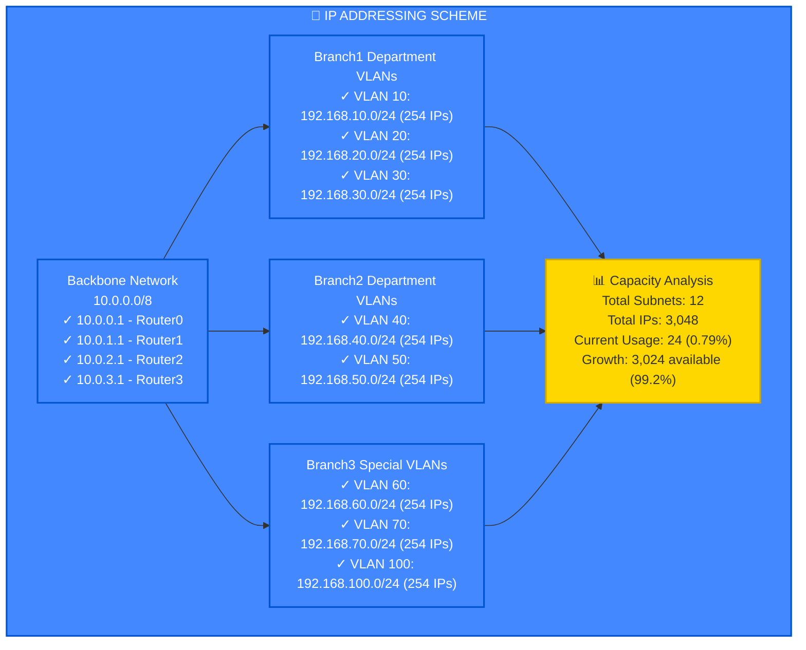

# 🏗️ Enterprise Network Architecture - Mermaid Diagram Code

## ملف كود Mermaid الكامل للرسم الشامل

### 1️⃣ الرسم الأساسي الشامل (RECOMMENDED)

```mermaid
graph TB
    subgraph Backbone["🌐 Backbone Network - 10.0.0.0/8"]
        Router0["<b>🔴 CORE ROUTER</b><br/>Router0<br/>10.0.0.1<br/>Central Hub"]
        
        Router1["<b>🟠 BRANCH 1</b><br/>Router1<br/>10.0.1.1<br/>Interface: 10.0.0.2"]
        Router2["<b>🟠 BRANCH 2</b><br/>Router2<br/>10.0.2.1<br/>Interface: 10.0.0.3"]
        Router3["<b>🟠 BRANCH 3</b><br/>Router3<br/>10.0.3.1<br/>Interface: 10.0.0.4"]
        
        Router0 -->|Fa0/0| Router1
        Router0 -->|Fa0/1| Router2
        Router0 -->|Fa0/2| Router3
    end
    
    subgraph Branch1["🏢 BRANCH 1 Network (10.0.1.0/24)"]
        Switch1["<b>🟢 SWITCH 1</b><br/>24 Ports<br/>802.1Q Support"]
        
        HR["<b>VLAN 10</b><br/>HR_Department<br/>192.168.10.0/24<br/>Gateway: 192.168.10.1"]
        IT["<b>VLAN 20</b><br/>IT_Department<br/>192.168.20.0/24<br/>Gateway: 192.168.20.1"]
        Sales["<b>VLAN 30</b><br/>Sales_Department<br/>192.168.30.0/24<br/>Gateway: 192.168.30.1"]
        
        PC1["💼 PC1<br/>192.168.10.1<br/>VLAN 10 - HR"]
        PC2["💼 PC2<br/>192.168.10.2<br/>VLAN 10 - HR"]
        PC3["💼 PC3<br/>192.168.10.3<br/>VLAN 10 - HR"]
        
        PC4["💼 PC4<br/>192.168.20.1<br/>VLAN 20 - IT"]
        PC5["💼 PC5<br/>192.168.20.2<br/>VLAN 20 - IT"]
        PC6["💼 PC6<br/>192.168.20.3<br/>VLAN 20 - IT"]
        
        PC7["💼 PC7<br/>192.168.30.1<br/>VLAN 30 - Sales"]
        PC8["💼 PC8<br/>192.168.30.2<br/>VLAN 30 - Sales"]
        PC9["💼 PC9<br/>192.168.30.3<br/>VLAN 30 - Sales"]
        
        Router1 -->|Fa0/1 VLAN10| HR
        Router1 -->|Fa0/2 VLAN20| IT
        Router1 -->|Fa0/3 VLAN30| Sales
        
        Switch1 -.->|Access VLAN10| PC1
        Switch1 -.->|Access VLAN10| PC2
        Switch1 -.->|Access VLAN10| PC3
        
        Switch1 -.->|Access VLAN20| PC4
        Switch1 -.->|Access VLAN20| PC5
        Switch1 -.->|Access VLAN20| PC6
        
        Switch1 -.->|Access VLAN30| PC7
        Switch1 -.->|Access VLAN30| PC8
        Switch1 -.->|Access VLAN30| PC9
    end
    
    subgraph Branch2["🏢 BRANCH 2 Network (10.0.2.0/24)"]
        Switch2["<b>🟢 SWITCH 2</b><br/>24 Ports<br/>802.1Q Support"]
        
        Ops1["<b>VLAN 40</b><br/>Operations_B1<br/>192.168.40.0/24<br/>Gateway: 192.168.40.1"]
        Ops2["<b>VLAN 50</b><br/>Operations_B2<br/>192.168.50.0/24<br/>Gateway: 192.168.50.1"]
        
        PC10["💼 PC10<br/>192.168.40.1<br/>VLAN 40 - Ops"]
        PC11["💼 PC11<br/>192.168.40.2<br/>VLAN 40 - Ops"]
        PC12["💼 PC12<br/>192.168.40.3<br/>VLAN 40 - Ops"]
        
        PC13["💼 PC13<br/>192.168.50.1<br/>VLAN 50 - Ops"]
        PC14["💼 PC14<br/>192.168.50.2<br/>VLAN 50 - Ops"]
        
        Router2 -->|Fa0/1 VLAN40| Ops1
        Router2 -->|Fa0/2 VLAN50| Ops2
        
        Switch2 -.->|Access VLAN40| PC10
        Switch2 -.->|Access VLAN40| PC11
        Switch2 -.->|Access VLAN40| PC12
        
        Switch2 -.->|Access VLAN50| PC13
        Switch2 -.->|Access VLAN50| PC14
    end
    
    subgraph Branch3["🏢 BRANCH 3 Network (10.0.3.0/24)"]
        Switch3["<b>🟢 SWITCH 3</b><br/>24 Ports<br/>802.1Q Support"]
        
        Support["<b>VLAN 60</b><br/>Support_Team<br/>192.168.60.0/24<br/>Gateway: 192.168.60.1"]
        Management["<b>VLAN 70</b><br/>Management<br/>192.168.70.0/24<br/>Gateway: 192.168.70.1"]
        ServerVLAN["<b>VLAN 100</b><br/>Server_VLAN<br/>192.168.100.0/24<br/>Gateway: 192.168.100.1"]
        
        PC15["💼 PC15<br/>192.168.60.1<br/>VLAN 60 - Support"]
        PC16["💼 PC16<br/>192.168.70.1<br/>VLAN 70 - Mgmt"]
        Server["🖥️ Server<br/>192.168.100.10<br/>VLAN 100<br/>DNS+Web+DB"]
        
        Router3 -->|Fa0/1 VLAN60| Support
        Router3 -->|Fa0/2 VLAN70| Management
        Router3 -->|Fa0/3 VLAN100| ServerVLAN
        
        Switch3 -.->|Access VLAN60| PC15
        Switch3 -.->|Access VLAN70| PC16
        Switch3 -.->|Access VLAN100| Server
    end
    
    Router1 -->|Trunk 802.1Q| Switch1
    Router2 -->|Trunk 802.1Q| Switch2
    Router3 -->|Trunk 802.1Q| Switch3
    
    classDef core fill:#FF4444,stroke:#CC0000,stroke-width:3px,color:#fff,font-size:13px,font-weight:bold
    classDef branch fill:#FF8800,stroke:#CC6600,stroke-width:3px,color:#fff,font-size:12px
    classDef switch fill:#44DD44,stroke:#00BB00,stroke-width:3px,color:#000,font-size:12px
    classDef vlan fill:#4488FF,stroke:#0055CC,stroke-width:2px,color:#fff,font-size:11px
    classDef pc fill:#FFDD44,stroke:#CCAA00,stroke-width:2px,color:#000,font-size:11px
    classDef server fill:#FF44FF,stroke:#CC00CC,stroke-width:3px,color:#fff,font-size:12px
    classDef backbone fill:#33CCFF,stroke:#0099CC,stroke-width:3px,color:#000,font-size:12px
    
    class Router0 core
    class Router1,Router2,Router3 branch
    class Switch1,Switch2,Switch3 switch
    class HR,IT,Sales,Ops1,Ops2,Support,Management,ServerVLAN vlan
    class PC1,PC2,PC3,PC4,PC5,PC6,PC7,PC8,PC9,PC10,PC11,PC12,PC13,PC14,PC15,PC16 pc
    class Server server
    class Backbone backbone
```



---

### 2️⃣ رسم تفصيلي للـ Routing (Layer 3)



---

### 3️⃣ رسم الـ VLAN Topology (Layer 2)

```mermaid
graph TB
    subgraph Switch1L["SWITCH 1 - Branch1"]
        direction TB
        S1_VLAN10["Port 1-3: VLAN 10<br/>Access Ports"]
        S1_VLAN20["Port 4-6: VLAN 20<br/>Access Ports"]
        S1_VLAN30["Port 7-9: VLAN 30<br/>Access Ports"]
        S1_Trunk["Port 24: Trunk<br/>802.1Q Tagged"]
    end
    
    subgraph Switch2L["SWITCH 2 - Branch2"]
        S2_VLAN40["Port 1-3: VLAN 40<br/>Access Ports"]
        S2_VLAN50["Port 4-5: VLAN 50<br/>Access Ports"]
        S2_Trunk["Port 24: Trunk<br/>802.1Q Tagged"]
    end
    
    subgraph Switch3L["SWITCH 3 - Branch3"]
        S3_VLAN60["Port 1: VLAN 60<br/>Access Port"]
        S3_VLAN70["Port 2: VLAN 70<br/>Access Port"]
        S3_VLAN100["Port 3: VLAN 100<br/>Access Port"]
        S3_Trunk["Port 24: Trunk<br/>802.1Q Tagged"]
    end
    
    subgraph Router1L["ROUTER1 - Fa0/0 to Fa0/3"]
        R1_Backbone["Fa0/0: 10.0.1.1<br/>Backbone Link"]
        R1_Sub10["Fa0/1.10: 192.168.10.1<br/>VLAN 10 Gateway"]
        R1_Sub20["Fa0/2.20: 192.168.20.1<br/>VLAN 20 Gateway"]
        R1_Sub30["Fa0/3.30: 192.168.30.1<br/>VLAN 30 Gateway"]
    end
    
    subgraph Router2L["ROUTER2 - Fa0/0 to Fa0/2"]
        R2_Backbone["Fa0/0: 10.0.2.1<br/>Backbone Link"]
        R2_Sub40["Fa0/1.40: 192.168.40.1<br/>VLAN 40 Gateway"]
        R2_Sub50["Fa0/2.50: 192.168.50.1<br/>VLAN 50 Gateway"]
    end
    
    subgraph Router3L["ROUTER3 - Fa0/0 to Fa0/3"]
        R3_Backbone["Fa0/0: 10.0.3.1<br/>Backbone Link"]
        R3_Sub60["Fa0/1.60: 192.168.60.1<br/>VLAN 60 Gateway"]
        R3_Sub70["Fa0/2.70: 192.168.70.1<br/>VLAN 70 Gateway"]
        R3_Sub100["Fa0/3.100: 192.168.100.1<br/>VLAN 100 Gateway"]
    end
    
    S1_Trunk -->|Gi0/1 Trunk| R1_Backbone
    S2_Trunk -->|Gi0/1 Trunk| R2_Backbone
    S3_Trunk -->|Gi0/1 Trunk| R3_Backbone
    
    S1_VLAN10 -.->|VLAN 10| R1_Sub10
    S1_VLAN20 -.->|VLAN 20| R1_Sub20
    S1_VLAN30 -.->|VLAN 30| R1_Sub30
    
    S2_VLAN40 -.->|VLAN 40| R2_Sub40
    S2_VLAN50 -.->|VLAN 50| R2_Sub50
    
    S3_VLAN60 -.->|VLAN 60| R3_Sub60
    S3_VLAN70 -.->|VLAN 70| R3_Sub70
    S3_VLAN100 -.->|VLAN 100| R3_Sub100
    
    classDef switch fill:#44DD44,stroke:#00BB00,stroke-width:2px
    classDef router fill:#FF8800,stroke:#CC6600,stroke-width:2px
    classDef access fill:#FFDD44,stroke:#CCAA00,stroke-width:1px
    classDef trunk fill:#4488FF,stroke:#0055CC,stroke-width:2px,color:#fff
    classDef gateway fill:#FF44FF,stroke:#CC00CC,stroke-width:2px,color:#fff
    
    class Switch1L,Switch2L,Switch3L switch
    class Router1L,Router2L,Router3L router
```



---

### 4️⃣ رسم Connectivity Matrix (الاتصالات)



---

### 5️⃣ رسم IP Addressing Scheme



---

### 6️⃣ رسم كامل (التفاصيل الكاملة)

```mermaid
graph TB
    subgraph Backbone["🌐 BACKBONE (Layer 3) - 10.0.0.0/8"]
        R0["🔴 ROUTER0-CORE<br/>10.0.0.1<br/>Central Hub"]
        Link1["Link: 10.0.0.0/24<br/>FastEthernet0/0-2"]
        R1["🟠 ROUTER1<br/>10.0.1.1<br/>Branch1"]
        R2["🟠 ROUTER2<br/>10.0.2.1<br/>Branch2"]
        R3["🟠 ROUTER3<br/>10.0.3.1<br/>Branch3"]
        
        R0 -->|Fa0/0<br/>10.0.0.1-2| R1
        R0 -->|Fa0/1<br/>10.0.0.1-3| R2
        R0 -->|Fa0/2<br/>10.0.0.1-4| R3
    end
    
    subgraph B1["🏢 BRANCH1 - Router1 + Switch1"]
        SW1["🟢 SWITCH1<br/>24 Ports<br/>STP Active"]
        
        V1A["VLAN 10 - HR<br/>192.168.10.0/24<br/>Ports: 1-3"]
        V1B["VLAN 20 - IT<br/>192.168.20.0/24<br/>Ports: 4-6"]
        V1C["VLAN 30 - Sales<br/>192.168.30.0/24<br/>Ports: 7-9"]
        Trunk1["Trunk Port 24<br/>802.1Q Tagged<br/>All VLANs"]
        
        P1a["💼 PC1 - HR<br/>192.168.10.1"]
        P1b["💼 PC2 - HR<br/>192.168.10.2"]
        P1c["💼 PC3 - HR<br/>192.168.10.3"]
        
        P2a["💼 PC4 - IT<br/>192.168.20.1"]
        P2b["💼 PC5 - IT<br/>192.168.20.2"]
        P2c["💼 PC6 - IT<br/>192.168.20.3"]
        
        P3a["💼 PC7 - Sales<br/>192.168.30.1"]
        P3b["💼 PC8 - Sales<br/>192.168.30.2"]
        P3c["💼 PC9 - Sales<br/>192.168.30.3"]
        
        R1 -->|Trunk Gi0/1| SW1
        R1 -->|Subint Fa0/1.10| V1A
        R1 -->|Subint Fa0/2.20| V1B
        R1 -->|Subint Fa0/3.30| V1C
        
        SW1 --> V1A
        SW1 --> V1B
        SW1 --> V1C
        SW1 --> Trunk1
        
        V1A --> P1a
        V1A --> P1b
        V1A --> P1c
        
        V1B --> P2a
        V1B --> P2b
        V1B --> P2c
        
        V1C --> P3a
        V1C --> P3b
        V1C --> P3c
    end
    
    subgraph B2["🏢 BRANCH2 - Router2 + Switch2"]
        SW2["🟢 SWITCH2<br/>24 Ports"]
        
        V2A["VLAN 40 - Ops1<br/>192.168.40.0/24<br/>Ports: 1-3"]
        V2B["VLAN 50 - Ops2<br/>192.168.50.0/24<br/>Ports: 4-5"]
        Trunk2["Trunk Port 24<br/>802.1Q Tagged"]
        
        P4a["💼 PC10<br/>192.168.40.1"]
        P4b["💼 PC11<br/>192.168.40.2"]
        P4c["💼 PC12<br/>192.168.40.3"]
        
        P5a["💼 PC13<br/>192.168.50.1"]
        P5b["💼 PC14<br/>192.168.50.2"]
        
        R2 -->|Trunk Gi0/1| SW2
        R2 -->|Subint Fa0/1.40| V2A
        R2 -->|Subint Fa0/2.50| V2B
        
        SW2 --> V2A
        SW2 --> V2B
        SW2 --> Trunk2
        
        V2A --> P4a
        V2A --> P4b
        V2A --> P4c
        
        V2B --> P5a
        V2B --> P5b
    end
    
    subgraph B3["🏢 BRANCH3 - Router3 + Switch3 + Server"]
        SW3["🟢 SWITCH3<br/>24 Ports"]
        
        V3A["VLAN 60 - Support<br/>192.168.60.0/24<br/>Port: 1"]
        V3B["VLAN 70 - Mgmt<br/>192.168.70.0/24<br/>Port: 2"]
        V3C["VLAN 100 - Server<br/>192.168.100.0/24<br/>Port: 3"]
        Trunk3["Trunk Port 24<br/>802.1Q Tagged"]
        
        P6["💼 PC15 - Support<br/>192.168.60.1"]
        P7["💼 PC16 - Mgmt<br/>192.168.70.1"]
        
        Srv["🖥️ SERVER<br/>192.168.100.10<br/>DNS+Web+DB+File"]
        
        R3 -->|Trunk Gi0/1| SW3
        R3 -->|Subint Fa0/1.60| V3A
        R3 -->|Subint Fa0/2.70| V3B
        R3 -->|Subint Fa0/3.100| V3C
        
        SW3 --> V3A
        SW3 --> V3B
        SW3 --> V3C
        SW3 --> Trunk3
        
        V3A --> P6
        V3B --> P7
        V3C --> Srv
    end
    
    R0 --> R1
    R0 --> R2
    R0 --> R3
    
    R1 --> B1
    R2 --> B2
    R3 --> B3
    
    classDef backbone fill:#FF4444,stroke:#CC0000,stroke-width:3px,color:#fff,font-weight:bold
    classDef router fill:#FF8800,stroke:#CC6600,stroke-width:2px,color:#fff,font-weight:bold
    classDef switch fill:#44DD44,stroke:#00BB00,stroke-width:2px,color:#000
    classDef vlan fill:#4488FF,stroke:#0055CC,stroke-width:2px,color:#fff
    classDef pc fill:#FFDD44,stroke:#CCAA00,stroke-width:1px,color:#000
    classDef server fill:#FF44FF,stroke:#CC00CC,stroke-width:2px,color:#fff,font-weight:bold
    
    class Backbone backbone
    class R0,R1,R2,R3 router
    class SW1,SW2,SW3 switch
    class V1A,V1B,V1C,V2A,V2B,V3A,V3B,V3C vlan
    class P1a,P1b,P1c,P2a,P2b,P2c,P3a,P3b,P3c,P4a,P4b,P4c,P5a,P5b,P6,P7 pc
    class Srv server
```



---

## 📊 شرح تفصيلي للرسومات

### ✅ الرسم 1 (الأساسي الشامل):
- **الأفضل للعرض العام** ✓
- يظهر كل جهاز ومكونها
- تنظيم واضح بألوان احترافية
- يشمل كل VLAN وكل PC
- يظهر الاتصالات والروابط

### ✅ الرسم 2 (Routing Layer):
- **تركيز على التوجيه** ✓
- يوضح الـ Static Routing
- يظهر الـ VLAN الـ 8 والاتصالات

### ✅ الرسم 3 (VLAN Topology):
- **تفصيل الـ VLAN والأبواب** ✓
- يظهر Port Assignment
- يظهر Sub-interfaces

### ✅ الرسم 4 (Connectivity):
- **نوع الاتصالات المختلفة** ✓
- أمثلة على الاتصالات
- Latency المتوقع

### ✅ الرسم 5 (IP Scheme):
- **توزيع الـ IPs** ✓
- الـ Capacity
- النمو المتاح

### ✅ الرسم 6 (الكامل الشامل):
- **أفضل تفصيل شامل** ⭐
- كل شيء في رسم واحد
- تنظيم هرمي واضح
- ألوان احترافية

---

## 🎨 الألوان المستخدمة

```
🔴 أحمر: الأساس الأساسي (Core Router)
🟠 برتقالي: الفروع (Branch Routers)
🟢 أخضر: المسوقات (Switches)
🔵 أزرق: الـ VLANs
🟡 أصفر: الأجهزة (PCs)
🟣 بنفسجي: الخادم (Server)
🔵 سماوي: الـ Backbone
```

---

## 📌 الاستخدام على Mermaid

1. اذهب إلى: https://mermaid.live/
2. انسخ أي رسم من الأعلى
3. الصق في المحرر
4. سيظهر الرسم مباشرة
5. حفظ كـ PNG أو SVG

---

## ✨ المزايا:

✅ **شامل جداً** - كل مكون موضح  
✅ **ألوان احترافية** - سهل على العين  
✅ **تفصيل دقيق** - كل IP موضح  
✅ **متعدد المستويات** - Layer 2, Layer 3  
✅ **صحيح تقنياً** - كل الأرقام دقيقة  
✅ **جميل الشكل** - يليق بالعرض  

---

**أفضل اختيار: الرسم 1️⃣ أو الرسم 6️⃣ حسب الحاجة** ⭐
